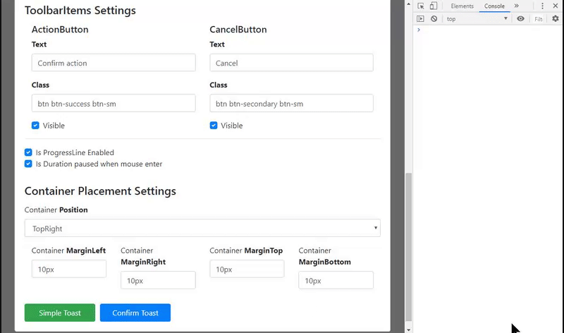

# Angular Bootstrap Toasts

This library provides you with the ability to display toast notifications.
It is advisable to have the bootstrap library installed for the correct display of notifications.
But this is not necessary, as you can easily customize everything using your classes.

## Install
`npm install angular-bootstrap-toasts --save`

## Demo
You can watch this [demo](demo/angular-bootstrap-toasts-demo/index.html) and experiment with toasts.

## Using
All what you need is import AngularBootstrapToastsModule from 'angular-bootstrap-toasts' and add to imports of your App Module.
Then you will have access to **AngularBootstrapToastsService** and **ToastsContainerComponent**.

### Service API:
- **ToastsList$: Observable<ToastMessage[]>** - Observable with array of toast messages;
- **DefaultTitle: string** - Default Title value;
- **DefaultText: number** - Default Text value;
- **DefaultDuration: number** - Default Duration time value;
- **showSimpleToast(params: ToastMessageParams)** - Show success toast message;
- **showConfirmToast(params: ToastMessageParams)** - Show toast message with confirmation and decline button variants;
- **changeDefaultTitle(newTitle: string)** - Change Default Title for all toasts wich not get `title` property from params when creating;
- **changeDefaultText(newText: string)** - Change Default Text for all toasts wich not get `text` property from params when creating;
- **changeDefaultDuration(duration: number)** - Change Default Duration for all toasts;

